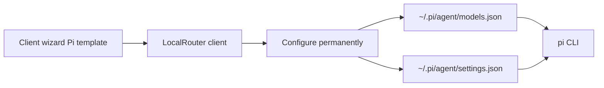

# Pi (pi.dev) Client Template Integration

## Context

LocalRouter connects coding agents via **client templates** ([`src/components/client/ClientTemplates.tsx`](src/components/client/ClientTemplates.tsx)) plus optional Rust writers under [`src-tauri/src/launcher/integrations/`](src-tauri/src/launcher/integrations/). Pi is not listed today.

Pi ([pi.dev](https://pi.dev/), docs: [custom models](https://pi.dev/docs/latest/models), [custom providers](https://pi.dev/docs/latest/custom-provider), [settings](https://pi.dev/docs/latest/settings)) is configured with plain JSON — **no extension required** for OpenAI-compatible gateways:

- `~/.pi/agent/models.json` — `providers.localrouter` with `baseUrl`, `api: "openai-completions"`, `apiKey`, `models[]`
- `~/.pi/agent/settings.json` — `defaultProvider` / `defaultModel` so new sessions use LocalRouter

Pi has **no built-in MCP** → template is `llm_only` / `supportsMcp: false`.

**Chosen approach (mirrors OpenClaw):** config-file permanent install; set defaults when LocalRouter is the only non-LocalRouter-competing setup (see below); no try-it-out env launch (same as OpenCode/OpenClaw).



## Step 0 — GitHub issue + plan file

1. Create a **feature request** on upstream [`LocalRouter/LocalRouter`](https://github.com/LocalRouter/LocalRouter) (per [CONTRIBUTING.md](CONTRIBUTING.md); this repo is fork `ereli/LocalRouter`). If create fails (permissions), create on `ereli/LocalRouter` and note that in the issue body.
2. Issue title/body outline:
   - Problem: popular open-source agent Pi has no LocalRouter client template
   - Desired: wizard + Configure permanently → OpenAI-compatible provider + default model
   - Config targets and docs links above
   - Out of scope: MCP, HTTPS-proxy autoconfig (Pi has `httpProxy` but no documented CA-injection path like Claude Code)
3. Save implementation plan with `./copy-plan.sh … PI_CLIENT_INTEGRATION` before coding (project rule).

## Implementation

### 1. Frontend template

Add to `CLIENT_TEMPLATES` in [`ClientTemplates.tsx`](src/components/client/ClientTemplates.tsx) (coding_assistants, near OpenClaw/OpenCode):

| Field | Value |
|--------|--------|
| `id` | `pi` |
| `name` | `Pi` |
| `setupType` | `config_file` |
| `defaultMode` | `llm_only` |
| `supportsMcp` | `false` |
| `supportsLlm` | `true` |
| `supportsProxy` | `false` (v1) |
| `docsUrl` | `https://pi.dev/docs/latest/models` |
| `binaryNames` | `['pi']` |
| `configFile.path` | `{{HOME_DIR}}/.pi/agent/models.json` |

JSON snippet shape:

```json
{
  "providers": {
    "localrouter": {
      "baseUrl": "{{BASE_URL}}/v1",
      "api": "openai-completions",
      "apiKey": "{{CLIENT_SECRET}}",
      "models": [{ "id": "…" }]
    }
  }
}
```

Use `/v1` like OpenCode (Pi’s docs examples include `/v1`). Models list filled dynamically when an integration sync provides them (same pattern as OpenCode’s `jsonSnippet: ({ models }) => …`).

Also document in HowToConnect via optional second file note: defaults live in `~/.pi/agent/settings.json` (`defaultProvider` / `defaultModel`) — written by the Rust integration (UI snippet can show models.json only, matching OpenClaw’s LLM-focused snippet).

### 2. Icon + ServiceIcon

- Add `public/icons/pi.svg` (and `website/public/icons/pi.svg`) from official [pi.dev/logo.svg](https://pi.dev/logo.svg) / wordmark.
- Map `pi` in [`ServiceIcon.tsx`](src/components/ServiceIcon.tsx) ICON_MAP + emoji fallback (`π` or similar).

### 3. Rust `AppIntegration` (mirror OpenClaw)

New file [`src-tauri/src/launcher/integrations/pi.rs`](src-tauri/src/launcher/integrations/pi.rs):

- Detect binary `pi` via `find_binary`.
- `supports_permanent_config: true`, `supports_try_it_out: false`, `needs_model_list: true`.
- **Write/merge** `~/.pi/agent/models.json`:
  - Upsert `providers.localrouter` with `baseUrl = {base_url}/v1` (avoid double `/v1` if already present), `apiKey`, `api`, `models` from sync context (fallback `["auto"]` or first known client model — match whatever LocalRouter already uses for OpenClaw/OpenCode fallbacks).
  - On LLM sync-off: remove `providers.localrouter` only.
- **Write/merge** `~/.pi/agent/settings.json`:
  - Set `defaultProvider: "localrouter"` and `defaultModel` to first synced model id **when** there were no other providers in `models.json` before install (same sole-provider rule as OpenClaw’s primary-model claim in [`openclaw.rs`](src-tauri/src/launcher/integrations/openclaw.rs) ~193–214).
  - On later sync: if `defaultProvider` is still `localrouter`, refresh `defaultModel` to stay valid; do not overwrite if user changed provider.
- Use existing `backup::write_with_backup`.
- Unit tests: merge into existing JSON, sole-provider sets defaults, multi-provider leaves defaults alone, remove on unsync.

Register in [`integrations/mod.rs`](src-tauri/src/launcher/integrations/mod.rs): `mod pi`, `KNOWN_TEMPLATE_IDS`, `get_integration`, name tests.

**Do not** add Pi to `proxy_setup.rs` in this change (`supportsProxy: false`).

### 4. Demo mock

Update [`website/src/components/demo/TauriMockSetup.ts`](website/src/components/demo/TauriMockSetup.ts) `configure_app_permanent` / capabilities paths so `pi` returns sensible `modified_files` (`~/.pi/agent/models.json`, `~/.pi/agent/settings.json`) if other templates are specially cased there.

### 5. Optional known tools

Pi’s built-ins (`read`, `bash`, `edit`, `write`, `grep`, `find`, `ls`) can be listed in [`known_client_tools.rs`](crates/lr-config/src/known_client_tools.rs) for indexing defaults — nice-to-have, same style as Aider/Goose; skip if timeboxed (runtime discovery works for OpenClaw/OpenCode).

## Out of scope

- Pi as an `lr-coding-agents` executor (spawn Pi via MCP) — different feature.
- Pi extension (`pi.registerProvider`) — unnecessary; `models.json` is the documented path.
- HTTPS inspection proxy autoconfig.
- MCP wiring.

## Verification

- `rustup run stable cargo test -p localrouter-lib -- integrations::pi` (or workspace path that owns the module) + clippy/fmt per CLAUDE.md.
- Manual: create Pi client → Configure permanently → confirm `models.json` + `settings.json` → `pi --list-models` shows LocalRouter models / default applies.
- `npx tsc --noEmit` if TS types touched.

## Final steps (project rule)

Plan review → test coverage → bug hunt → commit only when you ask (user rule: no commit until requested).
