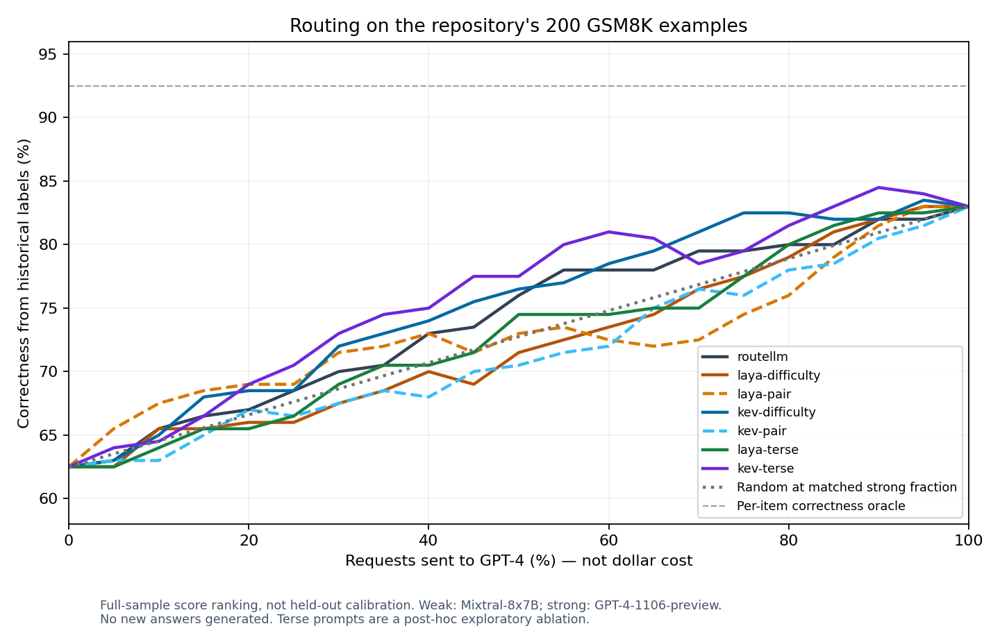

# Strong/weak routing with System One: research and local experiments

Research date: 2026-10-08 (Toronto; experiments after midnight UTC on October 9).

## Recommendation

**The user's clarified direction is configurable routing policies. See [Policy routing, mode metadata and local results](POLICY_ROUTING.md) for the primary recommendation, 72 additional cases, default/custom settings and verification of the supplied external research.** Replace the fixed strong/weak abstraction with explicit rules plus semantic route selection. Explicit plan-mode rules should run deterministically. The semantic tests do not justify silently replacing the old classifier with an untuned decision model.

The experiment below addresses the original question of predicting strong/weak answer quality. **Kev 0.8B on its dedicated MLX engine is the best candidate tested for further strong/weak evaluation, but this experiment does not establish a meaningful answer-quality improvement over RouteLLM.** Calibrate and evaluate any quality-based replacement against the actual model pair before making it the default. Laya English through the installed Ollaya is fast, but its context limit and sensitivity to wording/order make it a poor default for agent conversations.

A complete retirement of the old classifier is a reasonable destination. There is no need to maintain two routing implementations permanently. Keep the old implementation as an evaluation baseline until the new one passes a release gate, then remove its runtime, downloader and dedicated settings together. This task changes research artifacts only; production routing and user configuration are unchanged.

## What is running today

- `crates/lr-routellm/src/candle_router.rs`: `routellm/bert_gpt4_augmented`, XLM-RoBERTa, 512-token prefix truncation, Candle/Metal. It returns the softmax probability of the original strong-wins class, not a general difficulty score. The associated historical pair is GPT-4-1106-preview versus Mixtral-8x7B-Instruct-v0.1.
- `crates/lr-server/src/routes/pipeline.rs::spawn_routellm_classification`: joins **all string message contents in chronological order without role labels**, ignores array content, then classifies asynchronously. Combined with prefix truncation, an old system prompt can occupy the budget and exclude the latest request. This matters independently of model age.
- `crates/lr-router/src/lib.rs::select_models_for_auto_routing`: the precomputed decision selects either `prioritized_models` or `weak_models`. No classification result means the prioritized/strong list. There is no automatic cross-tier fallback in this selector.
- `crates/lr-config/src/types.rs`: default threshold 0.3. `src/components/routellm/ThresholdSelector.tsx` presents fixed usage, savings and quality estimates. They are hardcoded profiles, not measured for the selected models/workload.
- Existing native System One providers, model management, supervisor and typed answers already supply most of the replacement infrastructure. Public System One routing also permits chat emulation; internal classification must explicitly require a native local decision provider.

## Experiment

Hardware: **Apple M2 Max, 96 GiB RAM**. Existing installed **Ollaya 0.7.5**, `laya:en`, 421M, Metal; existing **Kev 1.0 / 0.8B**, engine commit `eb45fd2381396eb7edc3964b753ebc1b0ab1da2b`, MLX bf16, shipped temperature 2.3511. The app source currently pins Ollaya 0.9.0; the installed binary is older. This is not a test of a freshly upgraded Ollaya or all Laya variants. Detailed runtime/model metadata and the Laya manifest are in [environment.json](environment.json).

The baseline invokes the actual production `CandleRouter` through a small Rust example. No Python reimplementation. The decision models receive the same case text via isolated, authenticated loopback `/v1/systemone` endpoints. All weights were already cached. Kev's pinned runtime package/dependencies were restored. No private user conversations, cloud API credentials or cloud inference were used.

232 cases:

- 6 actual quick examples from `ThresholdSelector.tsx`.
- 7 actual verification prompts from `scripts/verify_routellm.py`.
- All 200 records in `crates/lr-routellm/tests/fixtures/gsm8k_sample.csv`, with existing weak/strong correctness labels.
- 19 explicitly authored stress cases: short hard/long easy, recent-turn relevance, technical vocabulary in easy tasks, quoted problems, embedded routing instructions, Spanish, tool-error context and empty input.

The 23 subjective weak/strong labels were assigned before the full benchmark: five UI examples and eighteen stress cases. The elementary induction proof, verification prompts and empty input have no subjective label. These labels are **policy expectations**, not observed answer correctness. Even the P=NP example means “demanding,” not that a strong model can solve it.

Two questions were frozen before the full runs: a descriptive difficulty choice and a named historical-pair benefit choice. A third, terse difficulty question was added **after seeing the initial results**. Treat it as exploratory prompt tuning. Each run saves the exact question, three warmups, raw answers/errors and wall-clock timing. Extra controls reverse choice order on the 32 non-GSM8K cases and repeat the original difficulty question three times on those cases. No questions received labels as input.

### Answer-quality replay at equal routing budgets

For a fair descriptive comparison, sort the 200 scores and route exactly the highest 100 to GPT-4. Ties are broken by case ID. This uses the full sample: **it is not a calibrated deployment threshold or an untouched test-set result**. Correctness comes from the old fixture, not newly generated answers.

| Classifier/question | Correct at 50% strong | Warm wall p50 / p95, full run | Subjective labels matched at threshold 0.5 |
|---|---:|---:|---:|
| Existing RouteLLM | 76.0% (152/200) | 13 / 22 ms | 13/23 |
| Laya, descriptive difficulty | 71.5% (143/200) | 29 / 43 ms | 13/23; 3 requests rejected |
| Laya, terse difficulty, exploratory | 74.5% (149/200) | 27 / 39 ms | 14/23; 3 requests rejected |
| Kev 0.8B, descriptive difficulty | 76.5% (153/200) | 68 / 131 ms | 22/23 |
| Kev 0.8B, terse difficulty, exploratory | 77.5% (155/200) | 61 / 106 ms | 19/23 |
| Laya, named-pair question | 73.0% (146/200) | 40 / 62 ms | 7/23; 3 requests rejected |
| Kev 0.8B, named-pair question | 70.5% (141/200) | 69 / 104 ms | 10/23 |

Always weak: **62.5%**. Always strong: **83.0%**. Random selection with a 50% strong probability: **72.75% expected correctness**. Per-item correctness oracle: **92.5%**. The fixture contains 106 both-correct, 60 strong-only, 19 weak-only and 15 neither-correct examples; “strong” does not win every item.

Kev's descriptive result differs from RouteLLM by **one question**; the post-hoc terse variant by three. Neither is sufficient evidence of superiority. Routing fraction is not dollar savings: token lengths, model prices, response lengths, failed attempts and classifier overhead all matter. The random comparator matches request fraction, not realized dollar cost.



[SVG export](routing-curve.svg) · [machine-readable metrics](summary.json)

### What breaks in a direct swap

1. **The old threshold cannot carry over.** At 0.3, RouteLLM sends 98.5% of the math set to strong and achieves 83.5%; Kev's difficulty question sends 43.5% and achieves 74.5%. At 0.5, Kev sends only 0.5% to strong and achieves 63.0%. Calling a task “grade-school math” or “easy” does not predict this weak model's actual failure rate.
2. **Mentioning the model names does not fix calibration.** At 0.5, Kev's named-pair question sends 99% to strong; at equal 50% routing its ranking is worse than the difficulty question and random mixing. This wording largely measures a prior about the model names.
3. **Choice-order sensitivity is real.** Reversing the descriptive options changed 6/29 valid Laya decisions and 1/32 Kev decisions at 0.5. Mean absolute score changes were 0.118 and 0.041. The terse variants changed 3/29 and 3/32 respectively. Repeating identical descriptive inputs three times produced zero score changes at the returned precision; order effects are not sampling noise.
4. **Laya English still has a 512-token context here.** All three long stress cases returned HTTP 422 `STATE_TRUNCATED`. Kev accepted them and distinguished late hard work from a late easy goodbye. This does not validate Kev on arbitrary long conversations.
5. **Confidently returning a label is not proof of correctness.** Both tested APIs' choice `confidence` values behave as a margin in these two-option answers; they are not the probability that the selected chat model will succeed. Use explicitly named option probabilities and validate/calibrate their interpretation.

Selected existing UI examples, descriptive question, raw strong scores:

| Prompt | RouteLLM | Laya | Kev |
|---|---:|---:|---:|
| Greeting | .190 | .527 | .118 |
| Sky color | .388 | .376 | .259 |
| Capital of France | .391 | .444 | .151 |
| Balanced binary-search-tree implementation | .536 | .701 | .371 |
| Field-extension degree | .562 | .667 | .519 |
| Elementary induction proof | .667 | .676 | .459 |

The BST is Kev's single miss among the 23 descriptive-policy cases at 0.5. The proof has deliberately no subjective label: it is familiar boilerplate and “proof” alone should not force escalation.

### Limits

This is a small, mostly math, historical replay plus a hand-authored smoke test. It does not measure modern model pairs, actual cost, answer generation latency, blind domain transfer, concurrency or production traffic. Public benchmark contamination cannot be excluded. Multiple questions were compared, and the terse variant is explicitly post-hoc. No production threshold was selected. Latencies are serial warm timings on a shared developer laptop; Rust builds overlapped some runs. RouteLLM is timed in-process; System One timings include localhost HTTP. Laya's rejected requests are excluded from its latency quantiles and counted as failures in the subjective denominator. Raw logs preserve every failure. No model received automatic credit for falling back to strong.

## Developments worth considering as of October 8, 2026

- **vLLM Semantic Router / Decision 2.0.** There is active work beyond RouteLLM: pluggable classification and complexity signals, plus native typed decision models. Decision-2.0-Lux-9B returns choice/yes-no/score distributions with a 16,384-token context. Its published decision benchmarks are useful candidate-screening evidence, not proof of strong/weak routing quality. Larger than desirable for a default desktop classifier; worth a comparison if Kev 0.8B cannot meet the quality gate. [Runtime](https://github.com/vllm-project/semantic-router), [model card](https://huggingface.co/vllm-sr/Decision-2.0-Lux-9B).
- **Kev 0.8B / 4B and Laya variants.** Kev's author positions 0.8B as a small deployment/prototyping model and reports materially better out-of-domain behavior for 4B. Fine-tuning the adapter/head on measured routing outcomes is supported. Laya also has multilingual and typed-decisions checkpoints; the base English model remains 512 tokens, and its documentation explicitly warns that domain calibration is required. Those variants and Kev 4B were not benchmarked here. [Kev card](https://huggingface.co/jaredpalmer/kev-0.8b), [Laya card](https://huggingface.co/convaiinnovations/laya), [calibration semantics](https://github.com/NandhaKishorM/laya/blob/main/docs/questions-and-answers.md).
- **Ollaya is evolving quickly.** The latest release found was 0.12.0, October 6, with more model families and runtime improvements. It is an engine/model library, not itself a routing classifier. Updating its version does not establish task accuracy. [Release notes](https://github.com/ollaya-dev/ollaya/releases/tag/v0.12.0).
- **Routing-specific ModernBERT checkpoints exist.** `darkolorin/vibe-router-modernbert-v3` is trained for LFM2.5-1.2B versus GPT-5.2. Its card's measured table routes almost everything to cloud, and its recommended-threshold prose disagrees with its own test sweep. This is a useful example of pair-specific distillation, not a convincing generic default. [Model card](https://huggingface.co/darkolorin/vibe-router-modernbert-v3).
- **Arch-Router 1.5B** maps conversational intent to user-defined domain/action routes. Useful if the feature expands to routing among specialists, but it generates a route and is not directly an estimator of one model's incremental answer quality. Its model card declares a custom research license. [Model card](https://huggingface.co/katanemo/Arch-Router-1.5B).
- **SWE-Router, June 30, 2026**, routes using a cheap model's partial agent trajectory rather than only the initial issue. That fits coding traffic better conceptually, but requires state and evidence across turns. It is not a drop-in request classifier. [Paper](https://arxiv.org/abs/2607.00053).
- **Evaluation has improved.** LLMRouterBench (January 2026) covers 400K+ instances, 21 datasets and 33 models and finds several newer/commercial methods do not reliably beat simple baselines. LLMRouter/xRouteBench (August) supplies 16+ routing implementations and broader tasks. These are useful evaluation/training resources, not another small model to download. [LLMRouterBench](https://arxiv.org/abs/2601.07206), [LLMRouter](https://arxiv.org/abs/2608.06867).
- **A very recent caution:** *Dynamic LLM Routers are Often Misguided* (October 2, preprint) found six commercial routers failed to beat random routing between well-chosen pairs at matched cost in its evaluated settings. This supports testing against simple baselines and actual outcomes; it does not prove every router is useless. [Paper](https://arxiv.org/abs/2610.02762).

I found no primary-source evidence that merely upgrading the original RouteLLM checkpoint provides a compelling modern replacement. The original project still exposes the same general router families and historical defaults. [Upstream implementation](https://github.com/lm-sys/RouteLLM/blob/main/routellm/routers/routers.py).

## Quality-based replacement design (optional policy template)

1. **Keep the product's strong/weak concept; replace the classifier service.** Introduce a `DecisionRoutingService` with a pinned native local `provider_instance + model`, versioned question/policy and calibration identifier. Default candidate: Kev 0.8B using the existing dedicated provider on Apple Silicon. Reuse Local Embedded engine installation, health, lifecycle and model management. Allow another native System One model to be selected without editing routing code.
2. **Make a direct internal provider call.** Invoke the registry's explicit provider/model `systemone()` method, with a deadline, concurrency limit and native-capability check. Do not send a recursive request to `localrouter/auto` or allow silent cloud/chat emulation. Treat this classifier as explicitly configured internal infrastructure with its own lifecycle; it should not need to be in a client's answer-model allowlist. Preserve normal authorization for the model ultimately answering the user.
3. **Build a bounded, role-aware routing state.** Preserve the latest user request, relevant recent conversation and tool failures, plus capability requirements (images, tools, structured output, context length). Extract text from array content. Reserve space for the decision question. Never silently classify just the oldest prefix. Use model-specific token budgets; record truncation/omission and escalate when relevant context cannot be represented. Do not include image bytes in a text-only classifier.
4. **Separate capability rules from learned difficulty.** If the weak pool cannot satisfy the request's modality, context, tool or output requirements, use an eligible strong model directly. On missing model, invalid probabilities, timeout, overload or insufficient evidence, retain the existing strong-list fallback. For weak exhaustion, specify and test an explicit weak-to-strong fallback; avoid accidental behavior changes from merely swapping the classifier.
5. **Calibrate to actual model pairs.** Build a labelled dataset from public/repository examples plus opt-in representative tasks, run both selected answer models, score correctness, and record real cost and latency. Keep development, calibration and untouched test splits separated by task/template/conversation. Include cases where both fail and where weak wins. Start with threshold calibration; if the ranking is insufficient, fine-tune Kev's adapter/head or distill to a small ModernBERT routing classifier. Model names in a question are not a substitute for these outcomes.
6. **Define a release gate before selecting thresholds.** Suggested product targets, not measured claims: maintain at least 95% of always-strong quality on held-out tasks, beat random mixing at matched realized cost, materially reduce total cost, and meet a warm short-input p95 budget such as 150 ms on the reference Mac. Measure cold starts, simultaneous requests, long input tails, label permutation, prompt injection, streaming/non-streaming and request cancellation. The current math replay at 50% strong does not meet the suggested quality target.
7. **Migrate configuration and UI deliberately.** Preserve strong/weak model lists and enablement intent. Replace `RouteLLMConfig`/global settings with a versioned decision-routing config; never reinterpret a legacy 0.3 as a calibrated decision score. If the new model is unavailable, route strong and show setup status. Replace the standalone RouteLLM download view with model/provider selection and a preview showing the exact input, routing score, decision, latency and fallback reason. Remove the hardcoded savings/quality estimates. Invalidate calibration on model/policy/pool changes.
8. **Remove the old implementation after the gate.** Delete `lr-routellm`, dependencies used solely by it, startup service wiring, old downloader/commands and frontend mocks. Update all Tauri response/parameter types and demo handlers together. Rename `PreComputedRouting.win_rate` and monitor metadata to versioned routing-score fields, preserving readers for historical records. Offer explicit cleanup of old downloaded weights. Add migration/integration tests and run stable workspace Clippy, fmt, tests and TypeScript checks. Review the plan, coverage and edge cases, then commit and push the completed replacement.

There is no reason to impose a generated explanation on each request. A typed choice, score, policy version and explicit fallback reason are sufficient and keep overhead bounded.

## Reproduction

The original experiment is preserved at commit `6cc5abd0`, before the production RouteLLM crate was retired. To rerun the Rust baseline, check out that commit in a separate worktree and run its example there. Original fixture, UI prompt source, verification script and Rust helper are archived in `legacy-inputs/`; Python corpus preparation uses these snapshots. Reports describe the pre-replacement implementation as inspected on the research date.

All raw files use public/test data. GSM8K fixture attribution follows the repository's [fixture license](legacy-inputs/LICENSE). The question text and result files are part of this experiment, not a new pretrained model.

```sh
python3 research/strong-weak-2026-10-08/benchmark.py prepare
# Serve the installed Ollaya on a spare loopback port, with a local test key:
OLLAYA_HOST=127.0.0.1:19435 OLLAYA_API_KEY=local-routing-research \
  OLLAYA_DEVICE=metal OLLAYA_KEEP_ALIVE=-1 /path/to/ollaya serve
# In another terminal; same key for these isolated test servers only:
RESEARCH_API_KEY=local-routing-research python3 research/strong-weak-2026-10-08/benchmark.py run \
  --url http://127.0.0.1:19435 --model laya:en --policy difficulty \
  --output /tmp/laya-difficulty.jsonl
# Kev: install the pinned engine first; offline flags below prevent weight fetching.
HF_HUB_OFFLINE=1 TRANSFORMERS_OFFLINE=1 HF_HUB_DISABLE_TELEMETRY=1 \
  KEV_API_KEY=local-routing-research uv tool run --python 3.13 \
  --from 'kev[serve] @ git+https://github.com/jaredpalmer/kev@eb45fd2381396eb7edc3964b753ebc1b0ab1da2b' \
  python -m kev.serve --run jaredpalmer/kev-0.8b --port 19436
# Same benchmark command with port 19436, model kev-0.8b.
# --policy historical_pair or terse; --group ui,verify,stress --reverse;
# --group ui,verify,stress --repeats 3 for the repeatability control.
rustup run stable cargo run -p lr-routellm --example routing_research -- \
  "$HOME/.localrouter-dev/routellm/model" "$HOME/.localrouter-dev/routellm/tokenizer" \
  research/strong-weak-2026-10-08/cases.jsonl > /tmp/routellm.jsonl
python3 -m unittest discover -s research/strong-weak-2026-10-08 -p 'test_*.py'
python3 research/strong-weak-2026-10-08/analyze.py
# Optional, requires matplotlib; regenerates the plot from the checked-in results:
MPLCONFIGDIR=/tmp/routing-matplotlib python3 research/strong-weak-2026-10-08/analyze.py --plot
```

`analyze.py` reads the seven checked-in full runs. `benchmark.py summarize /tmp/example.jsonl` handles a new individual run. Warmups are excluded from reported request timings. The baseline's load took 2.72 seconds. The decision engines were already running, so this experiment does not compare cold-start time.

## Validation

Research metric tests cover strong-only, weak-only, both/neither correctness, exact threshold direction, failed predictions, missing-score rejection, deterministic budget ties and choice-order comparisons. Final workspace check outcomes are recorded in the accompanying plan.
